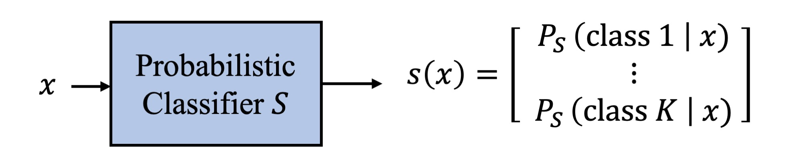
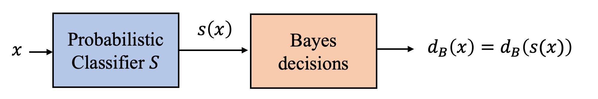
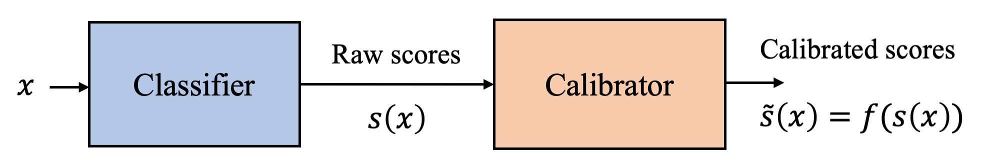
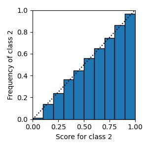
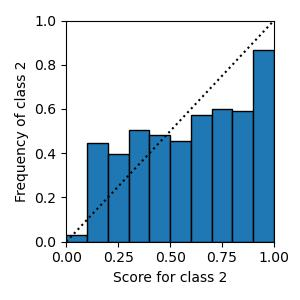

# Calibration Tutorial and Toolkit <!-- omit in toc -->

<div align='justify'>
  
  This repository includes a notebook showing the steps for assessing and fixing the calibration quality of a probabilistic classifier, and other notebooks for various analysis experiments. Before going into the code, though, we will give a very brief introduction to probabilistic classifiers and how to measure their performance, explaining how it can be decomposed into discrimination plus calibration components. We also discuss our view on the purpose of calibration analysis. References, proofs, and more detailed explanations on these issues can be found in the following paper:

*L. Ferrer, ["Analysis and Comparison of Classification Metrics"](https://arxiv.org/abs/2209.05355), 	arXiv:2209.05355*

While the theory behind calibration can be a bit hard to grasp at first, fortunately, in practice, measuring and fixing calibration is extremely simple. If you just want to dive directly into the practical aspects, go straight to the [first notebook](#diagnosing-and-fixing-calibration).

Note that the actual toolkit is provided as two python packages, expected_cost and psrcal, that can be installed through pip install. The notebooks here are a gentle introduction on how to use those packages for assessing the performance of posteriors.

# Table of contents <!-- omit in toc -->

- [Theory](#theory)
  - [Bayes decisions](#bayes-decisions)
  - [Proper scoring rules](#proper-scoring-rules)
  - [Calibration](#calibration)
    - [Calibration Metrics](#calibration-metrics)
    - [Calibration + discrimination decomposition](#calibration--discrimination-decomposition)
    - [Post-hoc calibration transforms](#post-hoc-calibration-transforms)
  - [Summary](#summary)
- [Example script](#example-script)
- [Notebooks](#notebooks)
  - [Diagnosing and fixing calibration](#diagnosing-and-fixing-calibration)
  - [ECE vs calibration loss](#ece-vs-calibration-loss)
  - [Confidence intervals](#confidence-intervals)
- [Installation](#installation)


# Theory

In machine learning, a classifier is a system that is designed to predict a categorical class for each input sample. While the goal of these systems is to produce class labels, most classifiers have an intermediate step where they produce numerical scores for each class. The final label for a sample is then derived from these scores, for example, by choosing the class with the maximum score. 

A **probabilistic classifier** is a special type of classifier that produces scores that are posterior probabilities for the classes given the input features. 
  
<div align="center">

</div>

Most modern machine learning classification methods fall in this category. For example, any model trained with cross-entropy as objective function produces posterior probabilities. 

The advantage of (good) probabilistic classifiers is that they produce outputs that can be interpreted. Also, as explained below, posterior probabilities can be used to make decisions using Bayes decision theory. Bayes decisions are optimal in the sense that they minimize the expected value of a cost function of interest when all we know about our samples are the posteriors generated by the system. 

## Bayes decisions

Assume we have a certain cost function $C(y,d)$, where $y$ is the true class of the sample, which we assume to be an integer between 1 and $K$, and $d$ is the decision made by the system. **Our goal is to have the smallest expected cost (EC)**:

$$ \mathrm{EC} = E[C(y,d(x))]$$

where the expectation is taken with respect to some reference distribution $p(x,y)$ which we can write as $P(y|x)\ p(x)$ (the first probability is written in capital $P$ because it is the distribution of a discrete random variable, while the second probability is a probability density function). Bayes decision theory tells us that the EC is minimized by making, for every $x$, the following decision:

$$d(x) = d_B(x) = \mathrm{arg}\min_d \sum_{i=1}^K C(i,d) \ P(i|x)$$

These decisions minimize the expectation of the cost with respect to the reference distribution $P(y|x)\ p(x)$. Now, what exactly is that reference distribution? It should ideally be the "true" distribution of our data. Yet, the true underlying distribution that has generated our dataset is never known in practice. All we can ever get are models of this distribution, learned from data under certain assumptions. In particular, **probabilistic classifiers are models for $P(i|x)$**. Hence, we can use the score provided by the classifier for class $i$, $s_i(x)$, as the posterior we need to make Bayes decisions. That is, 
  
$$d_B(x) = \mathrm{arg}\min_d \sum_{i=1}^K C(i,d)\ s_i(x)$$
  
Note that the Bayes decisions only depend on the input features through our model for the posterior probabilities. Hence,  $d_B(x) = d_B(s(x))$.
  
<div align="center">

</div>
  
The usual argmax method used for multi-class classification, where the class with the maximum score is selected, is one instance of Bayes decision theory which corresponds to a cost function $C(y,d)$ where all errors ($d\ne y$) have a cost of 1 and correct decisions ($d = y$) have a cost of 0. The expected value of this cost function is the total error rate or probability of error.

In summary, making Bayes decisions is trivial once you have the posteriors. Of course, Bayes decisions will be good if the posteriors are good and bad if the posteriors are bad. So, how do we know if the posteriors generated by our classifier are good or bad? We use proper scoring rules.

## Proper scoring rules

A proper scoring rule (PSR) is a function $C'(y,s)$ of the score vector $s$ and the true class of the sample $y$ with a special property: the expectation of a PSR with respect to a certain distribution $Q$ over the classes (a vector of probabilities, one per class) is minimized when the score vector coincides with this distribution. 
  
$$  Q \in \mathrm{arg}\min_s E_Q[C'(y,s)] $$
  
This property gives us an intuition of why PSRs are good for assessing the performance of posterior probabilities. They encourage the scores to be the same as the distribution with respect to which we are taking the expectation. So, if we could take the expectation with respect to the true $P(y|x)$, the PSR would be minimized when the scores are identical to that distribution.
The problem is, again, that we do not have access to the true distribution. 

A perhaps more direct way to understand PSRs is by looking at how they can be constructed. Given a certain cost function $C$, we can create a corresponding PSR $C'$ as follows:
$$C'(y,s) = C(y,d_B(s))$$
That is, $C'$ measures the goodness of the score vector $s$ as the cost of the Bayes decisions that can be made based on it.
It can be shown that the $C'$ constructed in this way satisfies the defining property of a PSR discussed above. 

Simply put, **PSRs measure the quality of the posteriors by assuming we will use them to make Bayes decisions and measuring the quality of those decisions**. Remember that Bayes decisions are those that optimize the expected cost. Hence, PSRs simply measure how good is *the best we can do* with the posteriors we have.

Note that PSRs define a cost function per sample. To create a metric that reflects the performance of the posteriors over a dataset, we simply take the expectation of this function with respect to the distribution of the data. In practice, we usually just take the average PSR over our dataset. We call the resulting value expected PSR (EPSR).

$$\mathrm{EPSR} = \frac{1}{N}\sum_{i=1}^{N} C'(y_i, s(x_i))$$

where $N$ is the number of samples in the test dataset, $y_i$ is the true label  and $s(x_i)$ is the score vector generated by the system for sample $i$.

The most common PSR is the negative logarithmic loss. The expectation of this loss is the widely used cross-entropy. Another common PSR is the Brier loss, commonly used in medical applications. 

EPSRs can be normalized by dividing them by the EPSR of a system that outputs the prior distribution for every sample. This is the best possible system among those that do not have access to the input samples. Normalized EPSRs are easily interpretable: if their value is larger than 1.0 then it means the system is worse than a system that does not have access to the input samples. We would, in fact, be better off throwing away the system and replacing it by one that outputs the priors. So, if we want informative posteriors, at the very least **we need normalized EPSRs lower than 1.0**. If a system has a normalized cross-entropy larger than 1.0, we can immediately say that its posteriors are bad.

Note that, up to here we have not needed to talk about calibration. **The quality of the posteriors is measured by expected PSRs (EPSRs) like the cross-entropy. If all we want to know is how good our posteriors are, we do not need to assess calibration quality.** Yet, during development, we might wish to analyze whether our classifier is well calibrated because if it is not, we can get very cheap gains from fixing that problem.  

## Calibration

A probabilistic classifier is said to be **calibrated** if the scores it generates match the frequency of the classes given those scores. 
That is, if 
$$s_i = P(i|s)$$
where $P(i|s)$ is meant to be the "true" posterior probability of class $i$ given the score vector $s$ (note that the conditioning is not on $x$, as before, just on $s$). 

How can we check if this equality is satisfied for our scores? Unfortunately, we cannot since, again, the "true" distribution is not accessible to us in practical problems and it never will. Hence, we have no way to compare our scores to this unknown distribution. To move forward we will need to create models for $P(i|s)$. We will create these models to be functions of the score vector $s$. That is, we will take $P_M(i|s)=f(s)$. $P_M(i|s)$ can then be compared against the original scores to check whether they were calibrated or not. Further, this function can be used as a new score $\tilde s = f(s)$ which is now well-calibrated (if we have done our work of finding $f$ well). For this reason, $f$ is called a post-hoc calibrator or calibration transformation. The post-hoc term refers to the fact that the calibration transform is applied on the scores produced by a classifier as-is, rather than directly attempting to produce a well-calibrated classifier. We will usually skip the term post-hoc since that is the only type of calibration we are exploring in this tutorial. The figure below illustrates the calibration process. 

<div align="center">

</div>

### Calibration Metrics

For binary classification, a simple way to obtain $f$, called histogram binning, is to bin the scores for class 2 and compute the frequency of that class for the samples that fell in each bin. This process is illustrated in the plot below, commonly called reliability diagram, for a two-class system that is perfectly calibrated.

<div align="center">

</div>

The scores for class 2 in our dataset are binned into $M$ bins (in the example, $M=10$). The frequency of class 2 among the samples that fall in each bin is then plotted as the height of the bar. These frequencies are our calibrated scores for class 2, $\tilde s_2 = P_M(2|s)$. $\tilde s_1 = P_M(1|s)$ is equal to $1-\tilde s_2$ since the two posteriors need to sum to 1. Given a new sample, we can now run the system, get the score for class 2, find its corresponding bin, and set $\tilde s_2$ to be the frequency of the corresponding bar.

We can then compute some kind of distance between the score $s_2$ for each sample as it comes out of the system and the corresponding $\tilde s_2$. This is exactly what is done to compute the widely used Expected Calibration Error (ECE) metric. This metric is given by the weighted average of the distances between the height of those bars and the diagonal. That is:

$$\mathrm{ECE} = \frac{1}{N} \sum_{i=1}^N |\tilde s_2(x_i) - b(s_2(x_i))|$$

where $b$ is a function that maps $s_2$ to the average of the scores within the corresponding bin. Those familiar with the ECE may notice this is not the standard way to express the ECE. We like this expression better than the standard one because it makes explicit the fact that the ECE is simply an average distance between the original scores and those calibrated with histogram binning.

The figure below show the reliability diagram for a poorly calibrated system where we can see that the scores from the system do not match the frequencies for class 2.

<div align="center">

</div>

The ECE metric is intuitive but it is a pretty poor calibration metric for many different reasons, including the fact that it is based on histogram binning which is a rather fragile calibration approach, that it takes values that are not easily interpretable, and that it does not generalize well to the multi-class case. These issues are discussed in [one of the notebooks](#ece-vs-calibration-loss) and in the paper cited above. 

A much better calibration metric, in our opinion is the so called **calibration loss**. This metric is defined as follows:

$$\text{CalLoss} = \text{EPSRraw} - \text{EPSRmin}$$

where EPSRraw is some EPSR evaluated on the scores $s$ as they come out of the system, and EPSRmin is the same EPSR evaluated on the scores after a calibration transformation, $\tilde s = f(s)$. That is,

$$\text{CalLoss} = \frac{1}{N} \sum_{i=1}^N [C'(y_i, \tilde s(x_i)) - C'(y_i, s(x_i))]$$

Note the similarity between this expression and that of the ECE. Both are averages of over the data of some function of the raw and calibrated scores. In calibration loss that function is defined based on PSRs which, as we will see next, allows for a very useful decomposition.

Note also, that the calibration transform used to obtain $\tilde s$ can be, as for ECE, histogram binning, but it can also be any other transform. In a section below we describe a very simple and general calibration approach that, in our experience, is more robust than histogram binning.


### Calibration + discrimination decomposition

The CalLoss metric defined above provides us with a very useful decomposition of the EPSR of the classifier:

$$ \text{EPSRraw} = \text{EPSRmin} + \text{CalLoss} $$

The CalLoss term is the part of EPSRraw that can be reduced by doing calibration, i.e., just by transforming the scores generated by the classifier.
The EPSRmin term reflects the part of EPSRraw that cannot be improved by calibration, usually called the discrimination, refinement or sharpness. 
To improve a system's discrimination performance we need to go into the classifier and change the features, the architecture, the training data, the hyperparameters, etc. This is, in most cases, a much more costly endeavour than adding a calibration stage. 

**The calibration analysis tells us whether it is possible to get cheap gains in the performance of the posteriors just by adding a calibration stage to the system.**

How do we decide whether adding a calibration stage is worthwhile? The absolute CalLoss does not tell us much. A value of CalLoss of 0.05 means a different thing if EPSRraw is 0.1 than if it is 0.5. In the first case, 50% of the EPRSraw is due to miscalibration while in the second case, it is only around 10%. In the second case, one might decide that the extra stage is not necessary. For this reason, it is useful to compute the relative CalLoss, given by:

$$\text{RelCalLoss} = 100 \ \frac{\text{EPSRraw} - \text{EPSRmin}}{\text{EPSRraw}}$$

With this metric we can then directly judge the impact that adding a calibration stage would have on the quality of the posteriors. If the percentage is small, then we do not need to bother about adding a calibration stage. If the percentage is large, then we know that we can get a large relative improvement quite cheaply by adding a calibration stage to the system.


### Post-hoc calibration transforms 

How do we find the post-hoc calibration transformation $f(s)$? There's a large variety of methods for calibrating scores. Their goal is to get the best possible posteriors (ie, with the lowest EPSR) given the scores generated by the classifier. The histogram binning approach used to compute the reliability diagrams is one such calibration transformation. In the ECE metric, this transform is trained on the test data itself which is one of the flaws of this metric since the transform can easily overfit or underfit, depending on the number of bins, the amount of samples and the distribution of the raw scores, resulting in an overestimation or underestimation of the calibration error. We will see examples of this behavior in [one of the notebooks](#ece-vs-calibration-loss).

Another common calibration method is to transform the scores with an affine transformation:

$$ f(s) = \tilde{s} = \alpha s + \beta $$

where $\alpha$ is usually a scalar and $\beta$ can be either fixed at 0 (in which case this method is called temperature scaling), or a vector of dimension $K$, as $s$ and $\tilde{s}$. We will see examples of this method in the notebooks. The parameters $\alpha$ and $\beta$ are trained to minimize an EPSR, most commonly the cross-entropy. The training data can be the test data itself, as for the ECE, but we strongly recommend to use either cross-validation or a held-out set to train the calibration transform to avoid overestimating CalLoss due to overfitting. 

Note that the definition of calibration loss does not specify which calibration transform to use or how to train it. This can feel somewhat unsettling since it means that we would get different estimates of the calibration loss depending on how we choose to calibrate. This problem is, in fact, inherent to the concept of calibration and it stems from the fact that, as discussed above, the posterior probability that we would like to compare against, $P(i|s)$ is not and will never be known to us. So, we replace it with models that are based on assumptions and trained on some dataset. As any time we train a model, though, we never know if we are doing the best we can. All we can aim for is to improve upon what we had before. 

The essential thing to note is that diagnosing and fixing calibration issues is one and the same process when using CalLoss as metric. To know whether our classifier is well-calibrated we need to go ahead and attempt to add a calibration stage to the system, following good development practices as for any other system stage. **If adding a calibration stage led to improved EPSR, then we have both diagnosed and fixed the calibration problem at the very same time.** 

## Summary

**EPSRs are designed for the assessment of the quality of posterior probabilities.** The widely-used cross-entropy is a general-purpose example of an EPSR. When comparing two systems, a better cross-entropy tells us that the posteriors are better for making Bayes decisions and also more useful, more informative, more interpretable. 
To judge whether a classifier's posteriors are good we do not need calibration metrics, all we need are EPSRs.

**Calibration metrics tell us whether the posteriors can be improved by adding a calibration stage.** They are useful during development, when we still have a chance to modify the system. If we find we have a calibration problem, we can add a calibration stage and get cheap improvements in the performance of the posteriors. Of course, we can also try to get better posteriors by playing with the classifier itself, but that is usually a much more costly endeavour. Hence, if we care about having good posteriors, we should always first do a calibration analysis and get the most out of the classifier we already have. If, after calibration, the cross-entropy is still not considered good enough, then we know we need to roll up our sleeves and attempt to improve the classifier.

The bottom line is: If we have two systems $A$ and $B$, and 

$$\text{CalLoss}(A) > \text{CalLoss}(B)$$

but

$$\text{EPSRraw}(A) < \text{EPSRraw}(B)$$
  
then $A$ has better posteriors, regardless of the fact that it is worse calibrated than $B$. 
Now, if we are able to diagnose that a system has a large CalLoss, then we should also be able to add a calibration stage to the system and fix the problem. We do not have to put up with a miscalibrated system! Take a look at the next section to find out how to diagnose and fix calibration in practice.

# Example script

The script [example.py](example.py) contains all the steps needed for evaluating the posteriors from a classifier. It also shows how to implement the post-hoc calibration stage if it turns out the the classifier's output is poorly calibrated. It is run as follows:

```
python ./example.py
```

and generates the following message:

```
Overall performance before calibration (LogLoss) = 7.33
Overall performance after calibration (LogLoss) = 0.39
Calibration loss = 6.94
Relative calibration loss = 94.7%
```

You can use it to run the same analysis in your own data by changing the initial part where the scores and label variables are defined.

# Notebooks

This repository includes various notebooks that explain in detail through examples different practical and theoretical issues  about assessing the quality of posterior probabilities. Below we briefly describe the contents of each notebook.

## Diagnosing and fixing calibration 

You can find the notebook [here](notebooks/00_measure_perf_and_fix_calibration.ipynb).

This notebook shows how to measure discrimination and calibration performance of classifier and, if necessary, how to fix it. It includes three different scenarios depending on which data the calibration transform is trained on.

  * Training the transform on the test data (as usually done in the literature when computing calibration metrics like the ECE and many others)
  * Training the transform on held-out data (a good option when you have plenty of data)
  * Training the transform through cross-validation on the test data (a good option when you have a small test dataset)


## ECE vs calibration loss 

You can find the notebook [here](notebooks/10_ece_vs_calloss.ipynb).

This notebook compares calibration loss using different calibration approaches with ECE. It explores the issue of overfitting the calibration transform, and the effect of the train-on-test approach. It shows cases in which ECE fails to diagnose miscalibration. It also shows that, even when ECE works reasonably well, calibration loss gives a much more interpretable metric.


## Confidence intervals 

You can find the notebook [here](notebooks/20_confidence_intervals.ipynb).

This notebook shows how to compute confidence intervals using the bootstraping method for any performance metric and, in particular, for calibration loss which presents some additional complexity. 


# Installation

You can look at the pre-run notebooks directly from this website, but if you want to play with them, change values and re-run, or run the example.py script you should follow these steps:
   
1. Install two python packages:

    ```
    pip install expected_cost
    pip install psrcal
    ```

2. Test the installation by running the ```examples.py``` script.

3. Download the notebook of your choice from the notebooks directory (or clone the whole repository if you prefer), open jupyter notebook and load the notebook. You can then play with the code and see how the results or plots change.

If you just want to use the packages within your own code, you only need to do step 1 (and 2, if you want to make sure everything works fine before importing the packages in your code).

**Comments or questions?**

If you found mistakes or have any comments or questions, please feel free to raise an issue in github.

Also, please leave a star if you liked this repo.
  
  
  
**Acknowledgment**  
This material is partly based upon work supported by the European Union’s Horizon 2020 research and innovation program under grant No 101007666/ESPERANTO/H2020-MSCA-RISE-2020 and by the Defense Advanced Research Projects Agency (DARPA) under Contract No. HR001120C0124. Any opinions, findings and conclusions or recommendations expressed in this material are those of the author(s) and do not necessarily reflect the views of the Defense Advanced Research Projects Agency (DARPA). 

</div>


